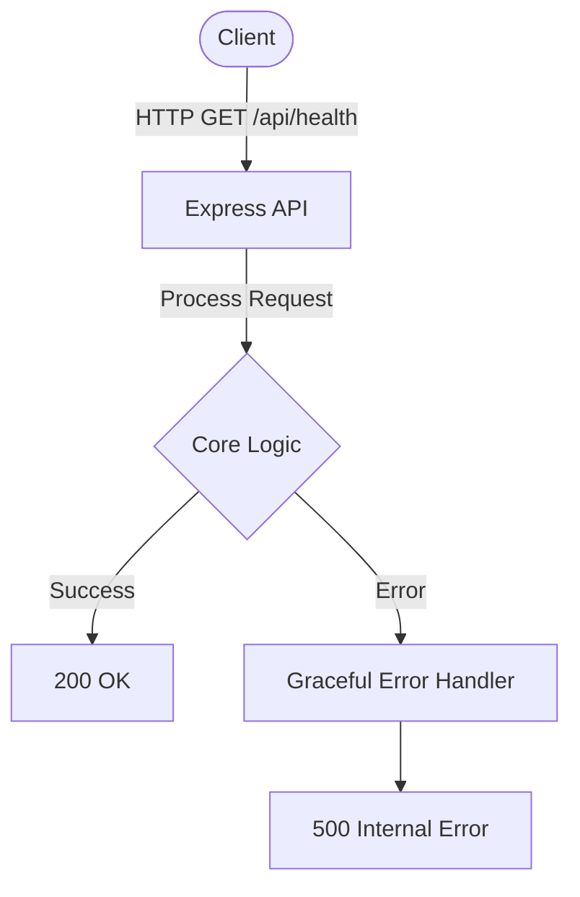

# context-

This repository is built with strict enterprise engineering standards, focusing on resilient architecture, graceful error handling, and robust continuous integration.

## 🏗️ System Architecture



## 🚀 Setup Instructions

```bash
docker-compose up --build -d
```

## 📂 Structure

- `index.js`: Main application entrypoint with global error handling and graceful shutdown.
- `Dockerfile`: Multi-stage ready, minimal attack surface Node.js container.
- `ci.yml`: Automated testing and container build validation.